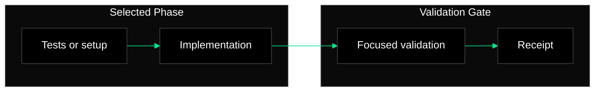

# Mermaid Style Guidance

Use Mermaid diagrams only when they make the phase execution easier to review.
Prefer one small diagram over multiple detailed diagrams.

## Defaults

- Group major branches with subgraphs so Mermaid can position related nodes
  with more separation.
- Use `flowchart LR` for broad architecture and `flowchart TD` for short
  validation paths.
- Keep node labels short.
- Avoid product-specific names unless they are part of the selected tasks.
- Show the phase boundary clearly.
- Do not diagram unrelated phases.
- Use the dark/emerald style below unless the project already has diagram
  styling.

## Colours

- Outer subgraphs: `#0A0A0A` background, `#424242` border
- Inner subgraphs: `#1E1E1E` background, `#424242` border
- Nodes/files/components: `#000000` fill, `#424242` border, `#ffffff` text
- Arrows: `#00E589`
- Edge labels: `#0A0A0A` background

## Example

