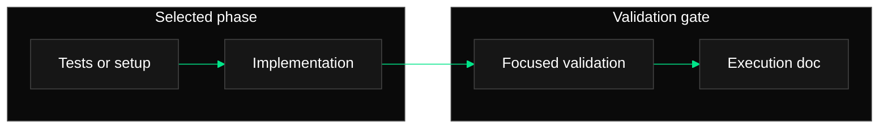

# Phase Execution Document Template

Use this structure for the Markdown document written at the selected phase's
`documentation_path`.

````markdown
# Phase [PHASE_NUMBER]: [PHASE_TITLE]

## Scope

- Tasks file: `[TASKS_PATH]`
- Completed task IDs: [COMPLETED_TASK_IDS]
- Documentation path: `[DOCUMENTATION_PATH]`

## Work Completed

Summarize only the implementation, setup, and test-first work completed in this
selected phase. Keep the summary concise and tied to task IDs.

## Changed Files

- `[PATH]` - [modified or added/created; brief selected-phase reason]

## Validation

| Command | Status | Notes |
| --- | --- | --- |
| `[COMMAND]` | passed/failed/not run | [notes] |

## Phase Flow

Include one required styled Phase Flow Mermaid diagram unless the user
explicitly asked to omit diagrams for this run. Keep labels short and copy the
dark/emerald `classDef` and `linkStyle` lines from
`references/mermaid-style.md` exactly unless the project already has diagram
styling. Every command or step shown in the diagram must also be represented in
Work Completed, Validation, or Issues And Caveats.



## Issues And Caveats

Record blockers, selected-phase validation gaps, risky assumptions, or
follow-up work. Write `None` only when there are no caveats.

Do not invent undocumented validation steps. For example, do not claim a
"confirmed missing-module failure" unless the command appears in the validation
table or the gap is recorded here.
````

## Notes

Use generic paths and wording unless the user supplied project-specific
documentation requirements. If the user supplied an exact documentation path,
preserve it.
