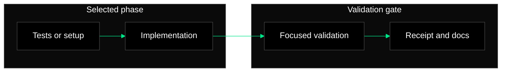

# Phase Execution Document Template

Use this structure for the Markdown document written at the selected phase's
`documentation_path`.

````markdown
# Phase [PHASE_NUMBER]: [PHASE_TITLE]

## Scope

- Tasks file: `[TASKS_PATH]`
- Completed task IDs: [COMPLETED_TASK_IDS]
- Documentation path: `[DOCUMENTATION_PATH]`
- Receipt path: `[RECEIPT_PATH]`

## Work Completed

Summarize the implementation, setup, and test-first work completed in this
phase. Keep the summary tied to task IDs.

## Changed Files

- `[PATH]` - [brief reason]

## Validation

| Command | Status | Notes |
| --- | --- | --- |
| `[COMMAND]` | passed/failed/not run | [notes] |

## Phase Flow

Use one high-level Mermaid diagram when it clarifies the phase. Keep labels
short and avoid project-specific styling.



## Issues And Caveats

Record blockers, validation gaps, risky assumptions, or follow-up work. Write
`None` only when there are no caveats.
````

## Notes

Use generic paths and wording unless the user supplied project-specific
documentation requirements. If the user supplied an exact documentation or
receipt path, preserve it.
