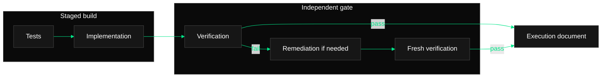

# Phase Execution Document Template

The documentation agent writes this document only after a fresh verifier
returns a passing verdict. Replace every placeholder. Do not write the final
marker for a failed or incomplete workflow.

````markdown
# Phase [PHASE_NUMBER]: [PHASE_TITLE]

## Workflow Status

- Tasks file: `[TASKS_PATH]`
- Completed task IDs: [COMPLETED_TASK_IDS]
- Final verification: passed
- Documentation path: `[DOCUMENTATION_PATH]`
- Final commit before documentation: `[PRIOR_SHA_OR_NO_COMMIT]`
- Commit mode: committed stages / `--no-commit`

## Staged Execution

| Stage | Task IDs | Status | Commit SHA | Reviewed manifest |
| --- | --- | --- | --- | --- |
| Test | [IDS_OR_SKIPPED] | passed / expected RED / skipped | [SHA_OR_NONE] | [PATHS_OR_NONE] |
| Implementation | [IDS_OR_SKIPPED] | passed / skipped | [SHA_OR_NONE] | [PATHS_OR_NONE] |
| Verification | none | passed | none | read-only |
| Remediation | [IDS_OR_NOT_RUN] | passed / not run | [SHA_OR_NONE] | [PATHS_OR_NONE] |
| Re-verification | none | passed / not run | none | read-only |
| Documentation | none | complete | [PENDING_PARENT_DOCS_COMMIT] | this document |

Record each remediation/re-verification cycle as its own row when one ran.
Never copy raw traces into this table.

## Work Completed

Summarize the phase-scoped test, implementation, and remediation results. Tie
each statement to task IDs and keep skipped stages explicit.

## Changed Files

- `[PATH]` - [stage; modified or added; concise reason]

List the union of reviewed stage manifests. Exclude pre-existing unrelated
dirty files and rejected generated artifacts.

## Validation

| Stage | Kind | Command | Status | Notes |
| --- | --- | --- | --- | --- |
| [STAGE] | focused / independent phase / regression | `[COMMAND]` | passed / expected RED | [compact result] |

Record intentional RED failures with the missing assigned implementation that
caused them. Record the final verifier's focused, independent-phase, and
suitable regression results.

## Verification And Remediation

- Initial verification findings: [SUMMARY_OR_NONE]
- Remediation attempts used: [0_TO_2]
- Final verification findings: [PASSING_SUMMARY]
- Remaining validation gaps: [NONE_OR_EXPLICIT_GAPS]

## Phase Flow

Include this styled Mermaid diagram unless the user explicitly opted out. Keep
labels short and copy the dark/emerald `classDef` and `linkStyle` lines from
`references/mermaid-style.md` exactly unless the project already has diagram
styling. Every shown validation step must also appear above.



## Issues And Caveats

Record blockers, validation gaps, expected RED context, risky assumptions, or
follow-up work. Write `None` only when there are no caveats.

<!-- phase-orchestrator:workflow-complete v2 -->
````

The exact final HTML comment is the durable workflow-complete marker consumed
by `scripts/phase_tasks.py`. Its presence means the document records a passing
fresh verification; it is not merely a documentation-exists flag.
