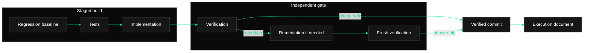

# Phase Execution Document Template

The documentation agent writes this document only after a fresh verifier
returns `passed`, `passed_with_deferred_findings`, or an accepted
test-authoring-only `expected_red` verdict. Replace every placeholder. Do not write the final
marker for a blocked or incomplete workflow.

````markdown
# Phase [PHASE_NUMBER]: [PHASE_TITLE]

## Workflow Status

- Tasks file: `[TASKS_PATH]`
- Completed task IDs: [COMPLETED_TASK_IDS]
- Final verification: passed / passed with deferred findings / expected RED
- Documentation path: `[DOCUMENTATION_PATH]`
- Final commit before documentation: `[PRIOR_SHA_OR_NO_COMMIT]`
- Commit mode: committed stages / `--no-commit`

## Staged Execution

| Stage | Task IDs | Status | Commit SHA | Reviewed manifest |
| --- | --- | --- | --- | --- |
| Regression baseline | none | recorded / unavailable | none | read-only |
| Test | [IDS_OR_SKIPPED] | passed / expected RED / skipped | [SHA_OR_NONE] | [PATHS_OR_NONE] |
| Implementation | [IDS_OR_SKIPPED] | passed / unresolved / skipped | [VERIFIED_COMMIT_SHA_OR_NONE] | [PATHS_OR_NONE] |
| Verification | none | passed / passed with deferred findings / remediation required | none | read-only |
| Remediation | [IDS_OR_NOT_RUN] | passed / unresolved / not run | [VERIFIED_COMMIT_SHA_OR_NONE] | [PATHS_OR_NONE] |
| Re-verification | none | passed / passed with deferred findings / not run | none | read-only |
| Documentation | none | complete | [PENDING_PARENT_DOCS_COMMIT] | this document |

Record each remediation/re-verification cycle as its own row when one ran.
Never copy raw traces into this table.

## Work Completed

Summarize the phase-scoped test, implementation, and remediation results. Tie
each statement to task IDs and keep skipped stages explicit.

## Changed Files

- `[PATH]` - [stage; modified or added; concise reason]

List the union of reviewed stage manifests. Exclude pre-existing unrelated
dirty files and rejected generated artifacts.

## Validation

| Stage | Kind | Command | Status | Notes |
| --- | --- | --- | --- | --- |
| [STAGE] | focused / independent phase / regression | `[COMMAND]` | passed / expected RED / deferred failure | [compact result] |

Record intentional RED failures with the missing assigned implementation that
caused them. Record the final verifier's focused, independent-phase, and
suitable regression results.

## Regression Baseline And Attribution

| Finding | Command | Baseline | Current | Attribution | Disposition | Downstream safe |
| --- | --- | --- | --- | --- | --- | --- |
| [FINDING_ID] | `[EXACT_COMMAND]` | [TEST_IDS_AND_SIGNATURES_OR_UNAVAILABLE] | [TEST_IDS_AND_SIGNATURES] | introduced / pre-existing unrelated / uncertain | remediated / deferred / blocked | yes / no / not applicable |

For every deferred regression, record the comparable non-secret environment
fingerprints, identical failing test identities and material signatures, lack
of additional failures, and the parent's remaining-phase dependency check.
Never include raw logs or secrets.

## Verification And Remediation

- Initial verification findings: [SUMMARY_OR_NONE]
- Remediation attempts used: [0_TO_2]
- Final verification findings: [PASSING_SUMMARY]
- Deferred findings: [CONFIRMED_FINDINGS_OR_NONE]
- Remaining validation gaps: [NONE_OR_EXPLICIT_GAPS]

## Phase Flow

Include this styled Mermaid diagram unless the user explicitly opted out. Keep
labels short and copy the dark/emerald `classDef` and `linkStyle` lines from
`references/mermaid-style.md` exactly unless the project already has diagram
styling. Every shown validation step must also appear above.



## Issues And Caveats

Record blockers, validation gaps, expected RED context, risky assumptions, or
follow-up work. Write `None` only when there are no caveats.

<!-- phase-orchestrator:workflow-complete v2 -->
````

The exact final HTML comment is the durable workflow-complete marker consumed
by `scripts/phase_tasks.py`. Its presence means the document records a
phase-safe fresh verification, including any strictly proven deferred findings;
it is not merely a documentation-exists flag.
